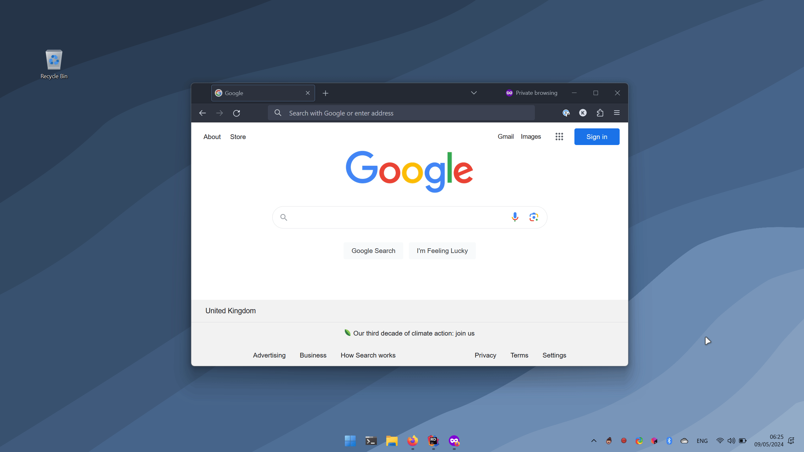



  

# Meet Randy

A Windows 11 application that only has one purpose: near-maximising (maximise minus padding) the active window using a
hotkey. 😀 By default, the padding is 30 px, but it can be configured in the settings.

Hit `Win` + `\` to use the hotkey. On an ISO keyboard, this requires only one hand and is next to `Win` + `Z` which is a
default Windows hotkey to create window groups.

The application is written in C#, using .NET 8 and WinForms. The latter may be an awful framework but was the fastest
way to get this done.

## Installation

1. Clone the repo and run `dotnet restore`
2. Run `dotnet publish -c Release -r win-x64 --self-contained`
3. You can then find `Randy.exe` in: `randy\Randy\bin\Release\net8.0-windows\win-x64\publish`
4. Move the content of the `publish` folder to a location of your choice
5. Run `Randy.exe` (as an administrator) and select `Start with Windows`

## Demo

## Notes

- The application auto-minimises to the system tray and is not visible when using `Alt` + `Tab`
- The application can start with Windows by attempting to 1) schedule a task with the Task Scheduler, 2) adding a
  shortcut to the Startup folder, and 3) adding a registry entry to the Run key
- Tray icon context menu changes based on the state of the application
- Logs from the current/most recent session are saved to `console-log.txt` in the same directory as the executable
- Pressing the hotkey again will restore the window size to its previous state
